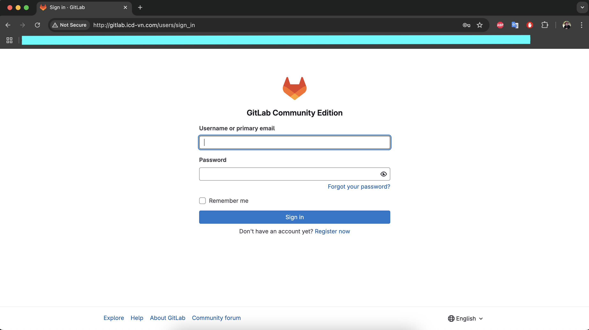
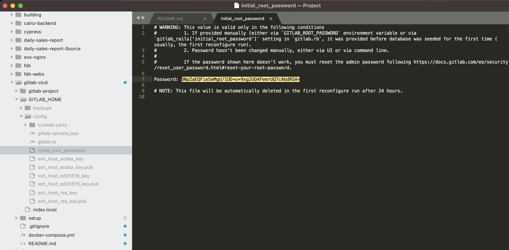
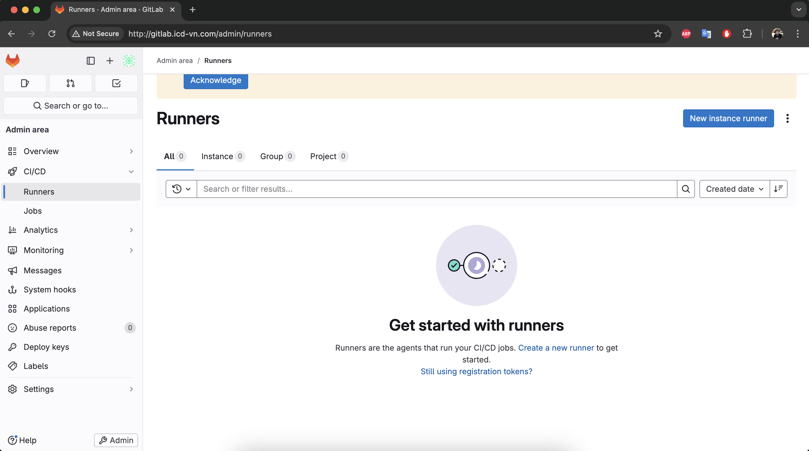
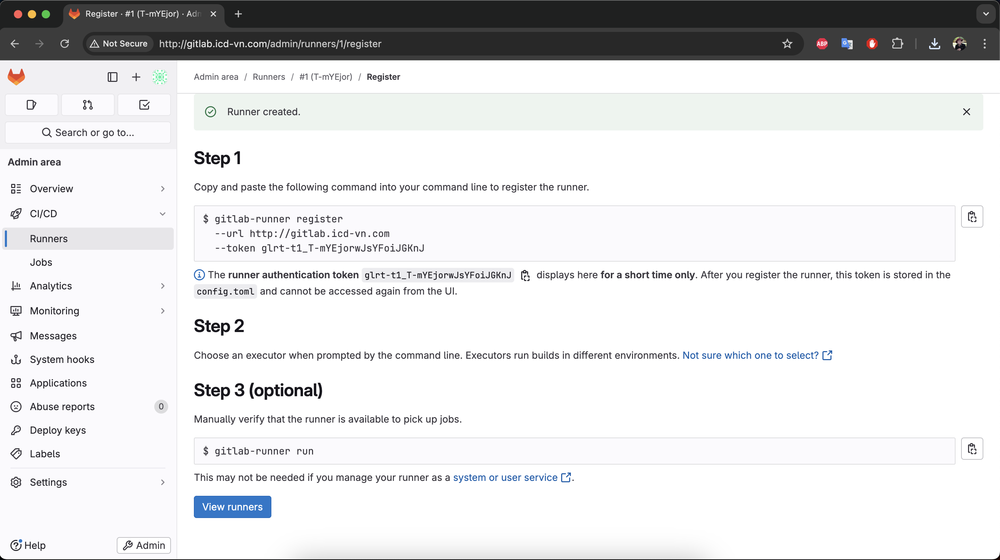
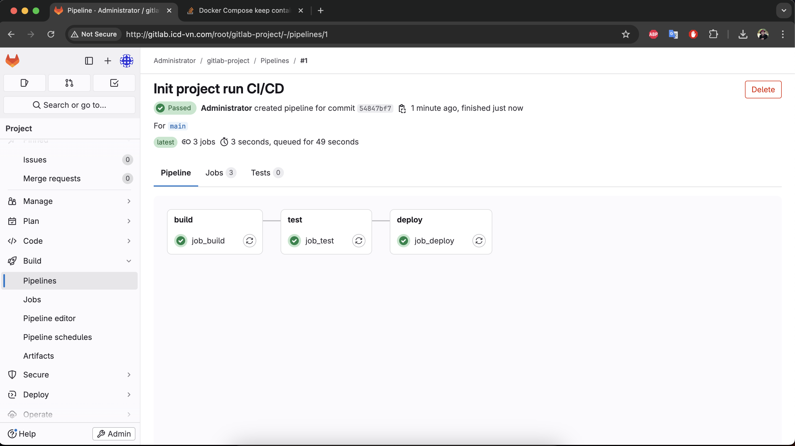

# GitLab CI/CD


## List version
[Docker Hub ](https://hub.docker.com/r/gitlab/gitlab-ce/tags)


## How to run?
```
docker compose up -d
```


## Browser



```
http://gitlab.icd-vn.com/
Username: root
~/GITLAB_HOME/config/initial_root_password has password when install gitlab
```



## How to run GitLab Runner?
### Create new runner




### Get token


```
Tags: shell
Token: glrt-t1_FNzAxifCS6Q1K4MpH1pR
```


## Use shell login to docker install GitLab Runner

### Setup GitLab Runner
```
./home/setup/install-gitlab-runner.sh
```

```
gitlab-runner register
```

```
  Input with params:
      url: http://gitlab.icd-vn.com
      token: glrt-t1_FNzAxifCS6Q1K4MpH1pR
      name: shell-nodejs
      executor: shell
```

### Run
```
gitlab-runner run
```

