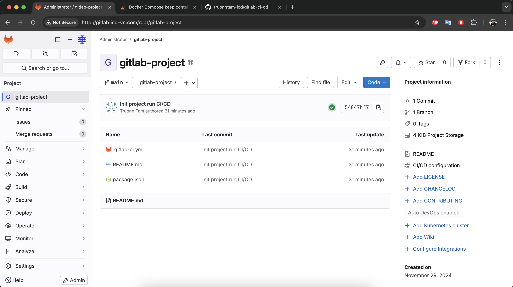

# CI/CD by .gitlab-ci.yml
## Create new project in GitLab



## Add SSH Key


## Commit and push

```
git init
git add --a
git commit -m "Init project run CI/CD"
git remote add origin git@gitlab.icd-vn.com:root/gitlab-project.git
git push origin main

```